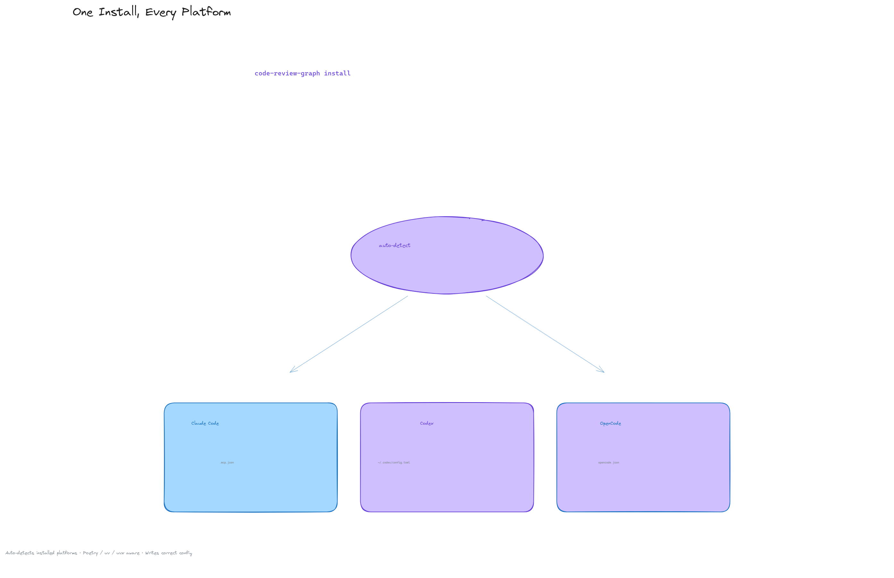
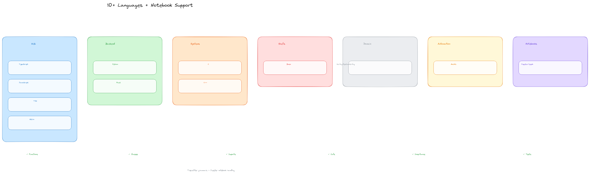

<h1 align="center">code-review-graph</h1>

<p align="center">
  <strong>不再浪费 token，让代码审查更智能。</strong>
</p>

<p align="center">
  <a href="docs/USAGE.md">使用指南</a> ·
  <a href="docs/COMMANDS.md">命令参考</a> ·
  <a href="docs/FAQ.md">常见问题</a> ·
  <a href="docs/TROUBLESHOOTING.md">故障排除</a> ·
  <a href="docs/ROADMAP.md">路线图</a>
</p>

<br>

`code-review-graph` 使用 [Tree-sitter](https://tree-sitter.github.io/tree-sitter/) 构建代码的结构化映射，增量跟踪变更，并通过 [MCP](https://modelcontextprotocol.io/) 为 AI 助手提供精准的上下文，使其只读取真正需要的内容。

<p align="center">
  
</p>

---

## 快速开始

```bash
git clone https://github.com/yanfeng98/nano-code-review-graph.git
cd code-review-graph
uv sync --extra dev                       # editable 安装 + 开发依赖(pytest/ruff/mypy)
uv run code-review-graph install          # 自动检测并配置所有支持的平台
uv run code-review-graph build            # 解析代码库
```

一条命令完成所有配置。`install` 会检测你安装了哪些 AI 编码工具，为每个工具写入正确的 MCP 配置，安装平台原生 hooks/skills，并将图感知指令注入平台规则文件。生成的 MCP 命令指向**本地包**（`uv run` / `-m code_review_graph`）而非 `uvx`——这份代码不发布到 PyPI，`uvx code-review-graph` 只会拉到上游原版。安装后请重启编辑器或工具。

<p align="center">
  
</p>

指定特定平台：

```bash
uv run code-review-graph install --platform codex       # 仅配置 Codex
uv run code-review-graph install --platform claude-code  # 仅配置 Claude Code
uv run code-review-graph install --platform opencode     # 仅配置 OpenCode
```

需要 Python 3.10+。建议用 [uv](https://docs.astral.sh/uv/) 管理。命令以 `uv run code-review-graph …` 或 `.venv/bin/code-review-graph …` 调用（取决于是否激活 venv）；`uvx` 不适用，因为本仓库不发布到 PyPI。

如需从 Git 项目中移除 CRG，可在工作树内任意位置使用对称的卸载命令。目标会被规范化为工作树根目录，非仓库目录会被拒绝。仅移除 CRG 拥有的文件和条目，不相关的 MCP 服务器、hooks、skills 和 JSONC 注释保持不变。共享配置的更改使用原子替换，失败写入不会影响原文件。

```bash
code-review-graph uninstall --dry-run    # 预览所有操作，不实际写入
code-review-graph uninstall              # 预览，确认后执行
code-review-graph uninstall --yes        # 无需确认直接执行
code-review-graph uninstall --all-repos  # 同时清理所有已注册仓库
code-review-graph uninstall --keep-data  # 移除集成但保留图数据库
code-review-graph uninstall --keep-user-configs --repo .  # 仅清理当前项目
```

然后打开项目，向 AI 助手发出指令：

```
Build the code review graph for this project
```

首次构建在 500 个文件的项目上大约需要 10 秒。此后，可通过 watch 模式以及支持的平台钩子自动更新图。

---

## 工作原理

<p align="center">
  
</p>

代码库通过 Tree-sitter 解析为 AST，以节点（函数、类、导入）和边（调用、继承、测试覆盖）的形式存储为图，然后在审查时查询，计算 AI 助手需要读取的最小文件集。

<p align="center">
   Tree-sitter 解析器 -> SQLite 图 -> 影响半径 -> 最小审查集" width="100%" />
</p>

### 影响半径分析

当文件发生变更时，图会追踪所有可能受影响的调用者、依赖项和测试。这就是变更的"影响半径"。AI 只需读取这些文件，而无需扫描整个项目。

<p align="center">
  
</p>

### 增量更新，不到 2 秒

启用 hooks 或 watch 模式后，文件保存和支持的提交钩子会触发增量更新。图对变更文件做差异比较，通过 SHA-256 哈希校验找到相关依赖，仅重新解析变更部分。一个 2,900 文件的项目重新索引不到 2 秒。

<p align="center">
  
</p>

### 解决 monorepo 问题

大型 monorepo 是 token 浪费最严重的地方。图能精准过滤——27,700+ 文件被排除在审查上下文之外，实际读取的仅约 15 个文件。

<p align="center">
  
</p>

### 广泛的语言支持 + Jupyter notebooks

<p align="center">
  
</p>

解析器支持跨语言解析函数、类、导入、调用点、继承和测试检测。当前支持包括 Python、JavaScript/TypeScript/TSX、Rust、C/C++、shell 脚本、Verilog/SystemVerilog、Ansible playbooks/roles/tasks、通过 TypeScript 解析器解析的 Astro 文件、Jupyter notebooks（`.ipynb`）。通用 YAML 不被视为源代码。


### 添加自定义语言（无需 fork）

如果你的仓库使用了解析器尚未覆盖的语言，只需在 `.code-review-graph/` 中创建一个 `languages.toml` 文件，将文件扩展名映射到 `tree_sitter_language_pack` 中任意内置的语法，以及函数、类、导入和调用的 tree-sitter 节点类型：

```toml
[languages.erlang]
extensions = [".erl"]
grammar = "erlang"
function_node_types = ["function_clause"]
class_node_types = ["record_decl"]
import_node_types = ["import_attribute"]
call_node_types = ["call"]
```

通用的 tree-sitter walker 会自动处理后续提取——无需修改代码，内置语言也永远不会被覆盖。详见 [docs/CUSTOM_LANGUAGES.md](docs/CUSTOM_LANGUAGES.md) 了解模式参考、验证规则和端到端示例。

---

## 功能

| 功能 | 详情 |
|---------|---------|
| **增量更新** | 仅重新解析变更文件。后续更新在 2 秒内完成。 |
| **广泛语言 + notebook 支持** | Python、JavaScript/TypeScript/TSX、Rust、C/C++、shell 脚本、Verilog/SystemVerilog、Ansible playbooks/roles/tasks、通过 TypeScript 解析器解析的 Astro 文件、Jupyter (.ipynb) |
| **影响半径分析** | 展示哪些函数、类和文件可能受变更影响 |
| **自动更新 hooks** | Hooks 和 watch 模式可在文件保存和支持的提交钩子时更新图 |
| **语义搜索** | 可选的向量嵌入，通过 sentence-transformers 或任何兼容 OpenAI 的端点（真实 OpenAI、Azure、new-api、LiteLLM、vLLM、LocalAI） |
| **交互式可视化** | 基于 D3.js 的力导向图，支持搜索、社区图例切换和按度缩放的节点 |
| **Hub 和 Bridge 检测** | 查找连接最多的节点和通过介数中心性识别的架构瓶颈 |
| **意外耦合评分** | 检测意外耦合：跨社区、跨语言、外围到 Hub 的边 |
| **知识缺口分析** | 识别孤立节点、未测试的热点、薄弱社区和结构弱点 |
| **智能建议问题** | 从图分析自动生成的审查问题（bridges、hubs、surprises） |
| **边置信度** | 三级置信度评分（EXTRACTED/INFERRED/AMBIGUOUS），边上带有浮点分数 |
| **图遍历** | 从任意节点开始的自由形式 BFS/DFS 探索，可配置深度和 token 预算 |
| **导出格式** | GraphML（Gephi/yEd）、Neo4j Cypher、Obsidian vault（含 wikilinks）、SVG 静态图 |
| **图差异比较** | 比较图快照随时间的变化：新增/删除的节点、边、社区变化 |
| **估算上下文节省** | 在相关 MCP/CLI 审查输出上附加紧凑的 `context_savings` 元数据，标注为估算并限制在三个小字段内 |
| **记忆循环** | 将问答结果持久化为 markdown 供重新摄取，使图从查询中增长 |
| **社区自动拆分** | 过大的社区（>25% 图规模）通过 Leiden 递归拆分 |
| **执行流程** | 从入口点追踪调用链，按加权关键度排序 |
| **社区检测** | 通过 Leiden 算法对相关代码进行聚类，支持大规模图的分辨率缩放 |
| **架构概览** | 自动生成的架构地图，含耦合警告 |
| **风险评分审查** | `detect_changes` 将差异映射到受影响的函数、流程和测试覆盖缺口 |
| **自定义语言** | 通过 `.code-review-graph/languages.toml` 添加新语言——无需 fork 或修改代码 |
| **重构工具** | 重命名预览、框架感知的死代码检测、社区驱动的建议 |
| **Wiki 生成** | 从社区结构自动生成 markdown wiki |
| **多仓库注册表** | 注册多个仓库，跨仓库搜索 |
| **多仓库守护进程** | `crg-daemon` 以子进程方式监视多个仓库，含健康检查和自动重启 |
| **MCP prompts** | 5 个工作流模板：审查、架构、调试、入门、合并前检查 |
| **全文搜索** | 基于 FTS5 的混合搜索，结合关键词和向量相似度 |
| **本地存储** | SQLite 文件在 `.code-review-graph/` 中。核心图存储无需外部数据库或云服务。 |
| **Watch 模式** | 持续工作时的图更新 |

---

## 使用指南

<details>
<summary><strong>斜杠命令</strong></summary>
<br>

| 命令 | 说明 |
|---------|-------------|
| `/code-review-graph:review_changes` | 审查自上次提交以来的变更 |
| `/code-review-graph:pre_merge_check` | 含风险评分的完整 PR 审查 |
| `/code-review-graph:debug_issue` | 引导式调试问题 |
| `/code-review-graph:architecture_map` | 生成架构文档 |
| `/code-review-graph:onboard_developer` | 生成新开发者入门指南 |

> 构建图不是斜杠命令，而是 MCP tool `build_or_update_graph_tool` 或 CLI `code-review-graph build` / `update`。

</details>

<details>
<summary><strong>CLI 参考</strong></summary>
<br>

```bash
code-review-graph install          # 自动检测并配置所有平台
code-review-graph install --platform <name>  # 指定特定平台
code-review-graph uninstall --dry-run  # 预览已安装构件的安全移除
code-review-graph build            # 解析整个代码库
code-review-graph update           # 增量更新（仅变更文件）
code-review-graph status           # 图统计信息
code-review-graph watch            # 文件变更时自动更新
code-review-graph visualize        # 生成交互式 HTML 图
code-review-graph visualize --format json      # 导出本地图数据为 JSON
code-review-graph visualize --format graphml   # 导出为 GraphML
code-review-graph visualize --format svg       # 导出为 SVG
code-review-graph visualize --format obsidian  # 导出为 Obsidian vault
code-review-graph visualize --format cypher    # 导出为 Neo4j Cypher
code-review-graph wiki             # 从社区生成 markdown wiki
code-review-graph detect-changes --brief         # 风险面板 + token 节省（只读）
code-review-graph update --brief                 # 刷新图 + 相同面板
code-review-graph detect-changes --brief --verify  # 对照 tiktoken 交叉检查
code-review-graph register <path>  # 在多仓库注册表中注册仓库
code-review-graph unregister <id>  # 从注册表中移除仓库
code-review-graph repos            # 列出已注册的仓库
code-review-graph daemon start     # 启动多仓库监视守护进程
code-review-graph daemon stop      # 停止守护进程
code-review-graph daemon status    # 显示守护进程状态和仓库
code-review-graph serve            # 启动 MCP 服务器
```

JSON 导出保留在本地图数据目录中，Git 默认忽略。它们可能包含绝对路径和代码结构元数据，在发布到机器外部之前请检查并清理导出内容。

</details>

<details>
<summary><strong>Token Savings 面板：<code>detect-changes --brief</code> vs <code>update --brief</code></strong></summary>
<br>

两个命令都打印相同的紧凑面板，展示图帮你节省了多少 token（相比将变更文件直接交给 agent）。**唯一**的区别在于：是否先刷新图。

```text
┌─────────────────────── Token Savings ────────────────────────┐
│ Full context would be:     12,921 tokens                     │
│ Graph context used:           762 tokens                     │
│ Saved:                     12,159 tokens (~94%)              │
│ Breakdown: Functions 244 · Tests 191 · Risk 244 · Other 83   │
└──────────────────────────────────────────────────────────────┘
```

| 命令 | 作用 | 何时使用 |
|---|---|---|
| `detect-changes --brief` | **只读。** 查看当前变更，查询**现有**图，打印面板。约 1 秒。 | 大多数情况——hooks（或 `crg-daemon`）在后台保持图更新，这已足够。 |
| `update --brief` | **首先将变更文件重新解析到图中**，然后打印相同的面板。约 5 秒。 | rebase 后、大量变更后，或任何时候你怀疑图可能过时时。 |

两者最终显示**相同的面板**，因为最后都调用同一个 `analyze_changes()` 步骤。区别仅在于该分析运行前图是否被刷新。

对任一命令添加 `--verify` 可对照 OpenAI 的 `cl100k_base` 分词器（GPT-4 系列）交叉检查显示的数字。需要 `pip install tiktoken`。在典型变更集上估算值与真实 token 的偏差保持在约 4% 以内。

相同的 `context_savings` 元数据也会自动附加到 `get_impact_radius`、`get_review_context`、`detect_changes` 和 `get_architecture_overview` MCP 工具的 JSON 响应中，使 AI agent 能够在对话中向人类展示节省效果，无需额外提示。

</details>

<details>
<summary><strong>多仓库守护进程</strong></summary>
<br>

如果你的编辑器不支持 hooks，或者你只想让图在后台自动保持最新而不需要任何编辑器集成，守护进程是为你准备的。它会监视你的仓库中的文件变更，自动重建图——无需手动 `build` 或 `update` 命令。

守护进程随 `code-review-graph` 一起提供——无需单独安装。

**快速设置：**

```bash
# 1. 注册想要监视的仓库
crg-daemon add ~/project-a --alias proj-a
crg-daemon add ~/project-b

# 2. 启动守护进程（在后台运行）
crg-daemon start

# 3. 完成——图会自动保持最新
crg-daemon status                 # 检查守护进程和每个仓库的监视器状态
crg-daemon logs --repo proj-a -f  # 跟踪特定仓库的日志
crg-daemon stop                   # 停止守护进程和所有监视器进程
```

也可以使用 `code-review-graph daemon start|stop|status|...`。

在底层，`crg-daemon add` 写入 TOML 配置文件到 `~/.code-review-graph/watch.toml`。你也可以直接编辑此文件：

```toml
[[repos]]
path = "/home/user/project-a"
alias = "proj-a"

[[repos]]
path = "/home/user/project-b"
alias = "project-b"
```

守护进程监视此配置文件的变化，在仓库添加或移除时自动启动/停止监视器进程。每 30 秒的健康检查会自动重启已死的监视器。无需外部依赖。

完整配置参考和所有可用选项见 [docs/COMMANDS.md](docs/COMMANDS.md#standalone-daemon-cli-crg-daemon)。

</details>

<details>
<summary><strong>30 个 MCP 工具</strong></summary>
<br>

图构建完成后，你的 AI 助手会自动使用这些工具。

| 工具 | 说明 |
|------|-------------|
| `build_or_update_graph_tool` | 构建或增量更新图 |
| `run_postprocess_tool` | 重新运行流程检测、社区检测和 FTS 索引 |
| `get_minimal_context_tool` | 超紧凑上下文（约 100 token）——先调用这个 |
| `get_impact_radius_tool` | 变更文件的影响半径 |
| `get_review_context_tool` | 含结构化摘要的 token 优化审查上下文 |
| `query_graph_tool` | 调用者、被调用者、测试、导入、继承查询 |
| `traverse_graph_tool` | 从任意节点出发的 BFS/DFS 遍历，含 token 预算 |
| `semantic_search_nodes_tool` | 按名称或含义搜索代码实体 |
| `embed_graph_tool` | 计算用于语义搜索的向量嵌入 |
| `list_graph_stats_tool` | 图的大小和健康度 |
| `get_docs_section_tool` | 检索文档章节 |
| `find_large_functions_tool` | 查找超过行数阈值的函数/类 |
| `list_flows_tool` | 按关键度排序的执行流程 |
| `get_flow_tool` | 获取单个执行流程的详情 |
| `get_affected_flows_tool` | 查找受变更文件影响的流程 |
| `list_communities_tool` | 列出已检测的代码社区 |
| `get_community_tool` | 获取单个社区的详情 |
| `get_architecture_overview_tool` | 来自社区结构的架构概览 |
| `detect_changes_tool` | 用于代码审查的风险评分变更影响分析 |
| `get_hub_nodes_tool` | 查找连接最多的节点（架构热点） |
| `get_bridge_nodes_tool` | 通过介数中心性查找瓶颈 |
| `get_knowledge_gaps_tool` | 识别结构性弱点和未测试的热点 |
| `get_surprising_connections_tool` | 检测意外的跨社区耦合 |
| `get_suggested_questions_tool` | 从分析中自动生成的审查问题 |
| `refactor_tool` | 重命名预览、死代码检测、建议 |
| `apply_refactor_tool` | 应用之前预览过的重构 |
| `generate_wiki_tool` | 从社区生成 markdown wiki |
| `get_wiki_page_tool` | 检索特定 wiki 页面 |
| `list_repos_tool` | 列出已注册的仓库 |
| `cross_repo_search_tool` | 跨所有已注册仓库搜索 |

**MCP Prompts**（5 个工作流模板）：
`review_changes`、`architecture_map`、`debug_issue`、`onboard_developer`、`pre_merge_check`

</details>

<details>
<summary><strong>配置</strong></summary>
<br>

如需排除某些路径不被索引，在仓库根目录创建 `.code-review-graphignore` 文件：

```
generated/**
*.generated.ts
vendor/**
node_modules/**
```

注意：在 git 仓库中，仅跟踪的文件会被索引（`git ls-files`），因此被 gitignore 的文件会自动跳过。使用 `.code-review-graphignore` 来排除已跟踪的文件或在不使用 git 时。

可选依赖组（本仓库用 `uv sync` 安装,不用 `pip install code-review-graph[...]`,后者会装到 PyPI 上游）:

```bash
uv sync --extra embeddings    # 本地向量嵌入（sentence-transformers）
uv sync --extra communities   # 社区检测（igraph）
uv sync --extra enrichment    # Python 调用解析增强（Jedi）
uv sync --extra wiki          # 含 LLM 摘要的 Wiki 生成（ollama）
uv sync --all                 # 所有可选依赖
```

### 环境变量

| 变量 | 说明 | 默认值 |
|----------|-------------|---------|
| `CRG_GIT_TIMEOUT` | Git 操作的超时秒数 | `30` |
| `CRG_DATA_DIR` | 覆盖图数据库和生成的图构件的目录 | - |
| `CRG_EMBEDDING_MODEL` | 向量嵌入的默认模型 | `all-MiniLM-L6-v2` |
| `CRG_ACCEPT_CLOUD_EMBEDDINGS` | 在显式确认后抑制云端嵌入出站警告 | - |
| `CRG_ALLOW_REMOTE_CODE` | 允许需要 `trust_remote_code=True` 的 HuggingFace 模型 | `0` |
| `CRG_MAX_IMPACT_NODES` | 影响分析中包含的最大节点数 | `500` |
| `CRG_MAX_IMPACT_DEPTH` | 影响半径分析的搜索深度 | `2` |
| `CRG_MAX_BFS_DEPTH` | 图遍历的最大深度 | `15` |
| `CRG_MAX_CHANGED_FUNCS` | 在一次变更报告中分析的最大变更函数数 | `500` |
| `CRG_MAX_TRANSITIVE_FRONTIER` | 传递性调用者/被调用者扩展的最大边界大小 | `50` |
| `CRG_TOOL_TIMEOUT` | 受限 MCP 工具的可选超时秒数（`0` 禁用超时） | `0` |
| `CRG_RECURSE_SUBMODULES` | 当设置为 `1`、`true` 或 `yes` 时，在文件收集中包含 git 子模块 | - |
| `CRG_TOOLS` | 逗号分隔的 MCP 工具允许列表，在启动服务时使用 | - |
| `CRG_OPENAI_BASE_URL` | 兼容 OpenAI 的嵌入端点 | - |
| `CRG_OPENAI_API_KEY` | 兼容 OpenAI 的嵌入 API key | - |
| `CRG_OPENAI_MODEL` | 兼容 OpenAI 的嵌入模型名称 | - |
| `CRG_OPENAI_DIMENSION` | 固定嵌入维度（v3 模型支持降维） | - |
| `NO_COLOR` | 如果设置，在终端中禁用 ANSI 颜色 | - |
| `CRG_SERIAL_PARSE` | 如果为 `1`，禁用并行解析（用于调试） | - |

兼容 OpenAI 的嵌入（真实 OpenAI、Azure 或任何自托管网关如 new-api / LiteLLM / vLLM / LocalAI / Ollama 在 openai 模式下）不需要额外安装——只需设置环境变量并传递 `provider="openai"` 给 `embed_graph`：

```bash
export CRG_OPENAI_BASE_URL=http://127.0.0.1:3000/v1     # 或 https://api.openai.com/v1
export CRG_OPENAI_API_KEY=sk-...
export CRG_OPENAI_MODEL=text-embedding-3-small          # 你的网关提供的任意模型
# 可选：
export CRG_OPENAI_DIMENSION=1536                        # 固定维度（v3 模型支持降维）
export CRG_OPENAI_BATCH_SIZE=100                        # 对于有严格批量限制的网关降低此值
                                                        # （如 Qwen text-embedding-v4 上限为 10）
```

当 base URL 指向 localhost（`127.0.0.1`、`localhost`、`0.0.0.0`、`::1`）时，云端出站警告会自动跳过。

> **模型选择提示。** 避免使用以 `-preview` / `-beta` / `-exp` 结尾的 model ID 用于长期保留——preview 模型可能更改权重（不同维度 → 需要完全重新嵌入）或在未通知的情况下被弃用。推荐使用稳定 GA 版本，如 `text-embedding-3-small` / `text-embedding-3-large`（OpenAI）、`Qwen/Qwen3-Embedding-8B`（通过自托管 vLLM / LocalAI）。
>
> `code-review-graph` 嵌入标识符、签名、结构上下文和有界的第一段 docstring/doc-comment 摘要。它不会传输函数体。在添加文档提取之前构建的图需要一次完整的 `code-review-graph build` 后再重新嵌入，以便每个文件都被重新解析。常规构建默认从不刷新嵌入。如需在构建后显式刷新现有索引，需同时传递 `--embedding-provider` 和 `--embedding-model`；云端选择可能会传输这些源自源代码的文本并产生 API 费用。

#### 工具过滤

CRG 默认暴露 30 个 MCP 工具。在 token 受限的环境中，你可以使用 `--tools` 或 `CRG_TOOLS` 环境变量将服务器限制为工具子集：

```bash
# 通过 CLI 标志
code-review-graph serve --tools query_graph_tool,semantic_search_nodes_tool,detect_changes_tool

# 通过环境变量
CRG_TOOLS=query_graph_tool,semantic_search_nodes_tool code-review-graph serve
```

CLI 标志优先级高于环境变量。当两者都未设置时，所有工具均可用。这对于 MCP 客户端配置特别有用：

```json
{
  "mcpServers": {
    "code-review-graph": {
      "command": "code-review-graph",
      "args": ["serve", "--tools", "query_graph_tool,semantic_search_nodes_tool,detect_changes_tool,get_review_context_tool"]
    }
  }
}
```

</details>

---

## 常见问题与对比

简短诚实的答案在 [docs/FAQ.md](docs/FAQ.md)：

- [vs LSP / 语言服务器](docs/FAQ.md#how-is-this-different-from-lsp-and-language-servers) — 一个持久化的跨语言图，而非每语言一个守护进程；LSP 在每个符号上更精确。
- [vs RAG / 嵌入](docs/FAQ.md#isnt-this-just-rag) — 从 AST 解析的结构边，而非相似度分块；嵌入是可选的，仅用于辅助搜索。
- [vs grep / agentic search](docs/FAQ.md#why-not-just-grep) — grep 在单跳查找上胜出；图在多跳问题上胜出（影响半径、调用者的调用者、测试、受影响的流程）。
- [vs Serena, codegraph, claude-context, repomix](docs/FAQ.md#how-does-it-compare-to-serena-codegraph-claude-context-and-repomix) — 客观对比表。
- [什么时候不应该使用它](docs/FAQ.md#when-should-i-not-use-it) — 小型仓库、简单单文件差异、一次性问题。
- [它会回传数据吗？](docs/FAQ.md#does-it-phone-home) — 不会；零遥测，云端嵌入是主动选择的。
- [如何验证它正在工作？](docs/FAQ.md#how-do-i-verify-it-is-working) — `status`、`detect-changes --brief`、`/mcp`。

## 故障排除

### `pip` / `pipx` 无法下载 `hatchling`（或 `Errno 9` / 到 PyPI 的 `Bad file descriptor`）

从**源码树**安装（例如 `pipx install .`）需要来自 **PyPI** 的构建依赖（例如 `hatchling`）。如果你在连接警告后看到 `Could not find a version that satisfies the requirement hatchling`，该**终端**中的 Python/pip 可能无法打开到 `pypi.org` 的 HTTPS 客户端（有时在集成编辑器终端中出现；系统范围内较少见，通常与 VPN、防火墙或代理有关）。

**选项：**

1. 从**外部终端**（而非 IDE 内嵌终端）运行相同命令，然后重试 `pipx install .` 或 `pipx install "git+https://..."`。
2. 使用 **[uv](https://docs.astral.sh/uv/)** 从 checkout 安装 CLI（在许多情况下使用与 `pip` 不同的下载机制）：

   ```bash
   cd /path/to/code-review-graph
   uv tool install . --force
   ```

3. 如需**在 clone 仓库中开发**而不进行全局安装，使用 `uv sync` 和 `uv run code-review-graph …`（或在 `uv sync` 后激活 `.venv`）。

## 开发与分发

> 本节面向**开发本仓库 / 分发本仓库**的用户：既想在本机编辑代码并让 AI 工具（Claude Code / Codex / OpenCode）在其他项目里立即使用你改过的版本（开发模式），也想把仓库打包后交给他人安装（本地分发，**不发布到 PyPI**）。

### 开发模式：编辑源码，即时生效（editable 安装）

把 `code-review-graph` 以**可编辑（editable）**方式装入环境，改代码无需重新安装。

```bash
git clone https://github.com/yanfeng98/nano-code-review-graph.git
cd code-review-graph

# uv 默认以可编辑方式安装项目本身，并同步依赖与开发工具
uv sync --extra dev        # 安装 pytest / ruff / mypy

# 开发循环
uv run code-review-graph build                 # 构建图
uv run pytest tests/ --tb=short -q            # 测试
uv run ruff check code_review_graph/          # lint
```

**关键：让其他项目使用你的编辑版。** 默认的 MCP 配置（`uvx` / PyPI）拉取的是发布版，改代码不生效。必须把 MCP 配置里的启动命令指向本地可编辑环境的**绝对路径**。

> **具体示例（本机，路径替换成你自己的仓库）：**
>
> ```bash
> claude mcp add --scope user code-review-graph -- \
>   /home/luyanfeng/luyanfeng/nano-code-review-graph/.venv/bin/code-review-graph serve --auto-watch
> ```
>
> 验证：在**任意目录**（含本仓库）运行 `claude mcp get code-review-graph`，应显示 `Scope: User config`、`Command` 指向上述绝对路径、`Status: ✓ Connected`；在 Claude Code 里输入 `/mcp` 也能看到连接状态。用**一条用户级注册**即可对所有项目生效；不要在本仓库 `.mcp.json` 里再留同名项目级条目，否则 `claude mcp list` 会报 `Conflicting scopes`。

> **Codex 同样可用（等价命令）：**
>
> ```bash
> codex mcp add code-review-graph -- \
>   /home/luyanfeng/luyanfeng/nano-code-review-graph/.venv/bin/code-review-graph serve --auto-watch
> ```
>
> `codex mcp add` 没有 `--scope` 参数——它总是写入用户级 `~/.codex/config.toml`（等价于 Claude 的 `--scope user`）。验证：运行 `codex mcp list`，应看到 `code-review-graph` 状态为 `enabled`，`Command` 指向上述绝对路径、`Args` 为 `serve --auto-watch`。

```jsonc
// Claude Code（全局）：~/.claude.json 顶层 mcpServers
// 或运行：claude mcp add --scope user code-review-graph -- /absolute/path/to/code-review-graph/.venv/bin/code-review-graph serve --auto-watch
{
  "mcpServers": {
    "code-review-graph": {
      "type": "stdio",
      "command": "/absolute/path/to/code-review-graph/.venv/bin/code-review-graph",
      "args": ["serve", "--auto-watch"]
    }
  }
}
```

```toml
# Codex：~/.codex/config.toml
# 或运行：codex mcp add code-review-graph -- /absolute/path/to/code-review-graph/.venv/bin/code-review-graph serve --auto-watch
[mcp_servers.code-review-graph]
command = "/absolute/path/to/code-review-graph/.venv/bin/code-review-graph"
args = ["serve", "--auto-watch"]
```

```jsonc
// OpenCode：~/.config/opencode/opencode.json 顶层 "mcp"
"mcp": {
  "code-review-graph": {
    "type": "local",
    "command": ["/absolute/path/to/code-review-graph/.venv/bin/code-review-graph", "serve", "--auto-watch"]
  }
}
```

这些是**全局（用户级）**配置，所有项目共用。每个目标项目以该项目为工作目录启动 server，自动读取各项目自己的 `.code-review-graph/graph.db`。改动源码后**即时生效**，重启编辑器加载新配置即可。

> **`--auto-watch` 才开启自动更新。** 不带 `--auto-watch` 时 `serve` 只在收到工具调用时响应，不监听文件；图仅在调用 `build_or_update_graph_tool` 或运行 `code-review-graph update` 时才做增量（只重扫改动文件，<2s）。带 `--auto-watch` 则用后台 watchdog 监听文件保存事件，自动增量更新并跑 post-processing（FTS/flows/communities）——所以 VSCode 里改完代码，图会随之刷新。它绑定**项目根**（server 启动时的 cwd 就近找 `.git`），每个项目用自己的 `.code-review-graph/graph.db`；依赖文件系统事件，在大仓库/网络挂载/某些容器文件系统上可能延迟或缺事件，此时用 `update` 兜底。改动 MCP 命令后需重启编辑器/CLI 才生效。

> **不要**用 `uv run code-review-graph serve` 作为 MCP 命令：`uv run` 会在**目标项目**（cwd）解析项目环境，非 uv 项目会启动失败。绝对路径指向本仓库 `.venv` 是最稳妥的。

### 打包分发：构建 wheel，本地交给他人（不发布 PyPI）

用 `uv build` 在本地构建分发文件，把产物直接交给他人用 `pip` 安装：

```bash
cd code-review-graph
uv build   # 产出 dist/code_review_graph-<版本>-py3-none-any.whl 和 .tar.gz
```

产物是**纯 Python** wheel（Python 3.10+）。**接收方每台机器安装一次：**

```bash
pip install code_review_graph-<版本>-py3-none-any.whl
# 或需要全部可选特性（embeddings / communities / enrichment / wiki）：
pip install "code_review_graph-<版本>-py3-none-any.whl[all]"
# uv 用户（作为全局 CLI 工具）：
uv tool install code_review_graph-<版本>-py3-none-any.whl
```

运行依赖（fastmcp、tree-sitter、networkx 等）会自动从 PyPI 安装——只有 code-review-graph 本体是本地分发的。

**注意：装一次，每个项目建一次图。** 图数据库 `.code-review-graph/graph.db` 是**每个项目各自的数据**（被 gitignore，不会随代码分发）。接收方在每个项目里只需建图，**无需重装包**：

```bash
cd 某个项目
code-review-graph build       # 生成该项目的图
# 或直接对 AI 助手说："Build the code review graph for this project"
```

其他分发方式：

- **给源码**：把整个仓库拷给对方，对方在仓库内 `pip install .`（现场构建，非可编辑）。
- **本地 wheel 源**（团队内部）：`pip install --find-links=/path/to/dist code-review-graph`（不要加 `--no-index`，否则依赖无法从 PyPI 解析）。

> wheel 是**构建时刻的快照**：之后改了代码需重新 `uv build` 才会更新产物。若新版本与他人已装的版本号相同，请先在 `pyproject.toml` 中 bump `version`（如 `2.3.7.post1`）。

## 贡献

```bash
git clone https://github.com/yanfeng98/nano-code-review-graph.git
cd code-review-graph
uv sync --extra dev                # editable 安装 + 开发依赖(pytest/ruff/mypy)
uv run pytest tests/ --tb=short -q # 测试
uv run ruff check code_review_graph/  # lint
```
