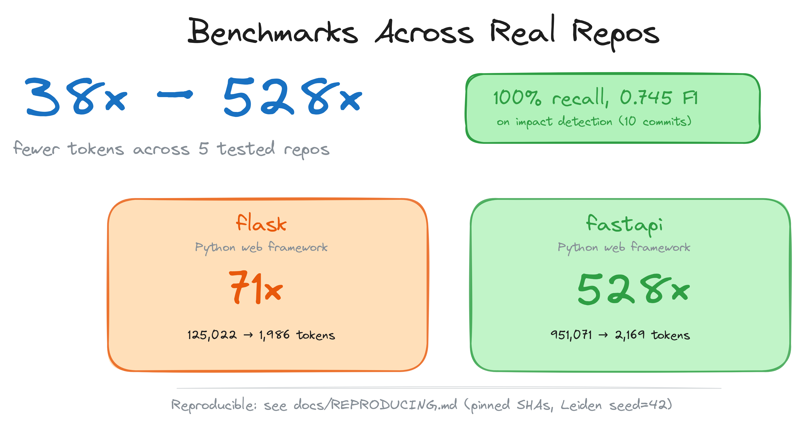

<h1 align="center">code-review-graph</h1>

<p align="center">
  <strong>不再浪费 token，让代码审查更智能。</strong>
</p>

<p align="center">
  <a href="https://code-review-graph.com"></a>
</p>

<p align="center">
  <a href="docs/USAGE.md">使用指南</a> ·
  <a href="docs/COMMANDS.md">命令参考</a> ·
  <a href="docs/FAQ.md">常见问题</a> ·
  <a href="docs/TROUBLESHOOTING.md">故障排除</a> ·
  <a href="docs/GITHUB_ACTION.md">GitHub Action</a> ·
  <a href="docs/REPRODUCING.md">复现基准测试</a> ·
  <a href="docs/ROADMAP.md">路线图</a>
</p>

<br>

`code-review-graph` 使用 [Tree-sitter](https://tree-sitter.github.io/tree-sitter/) 构建代码的结构化映射，增量跟踪变更，并通过 [MCP](https://modelcontextprotocol.io/) 为 AI 助手提供精准的上下文，使其只读取真正需要的内容。

<p align="center">
  
</p>

---

## 快速开始

```bash
pip install code-review-graph
code-review-graph install          # 自动检测并配置所有支持的平台
code-review-graph build            # 解析代码库
```

一条命令完成所有配置。`install` 会检测你安装了哪些 AI 编码工具，为每个工具写入正确的 MCP 配置，安装平台原生 hooks/skills，并将图感知指令注入平台规则文件。它会自动判断你是通过 `uvx` 还是 `pip`/`pipx` 安装的，并生成相应的配置。安装后请重启编辑器或工具。

<p align="center">
  
</p>

指定特定平台：

```bash
code-review-graph install --platform codex       # 仅配置 Codex
code-review-graph install --platform claude-code  # 仅配置 Claude Code
code-review-graph install --platform opencode     # 仅配置 OpenCode
```

需要 Python 3.10+。为获得最佳体验，建议安装 [uv](https://docs.astral.sh/uv/)（如果可用，MCP 配置将使用 `uvx`，否则回退到直接使用 `code-review-graph` 命令）。

如需从 Git 或 SVN 项目中移除 CRG，可在工作树内任意位置使用对称的卸载命令。目标会被规范化为工作树根目录，非仓库目录会被拒绝。仅移除 CRG 拥有的文件和条目，不相关的 MCP 服务器、hooks、skills 和 JSONC 注释保持不变。共享配置的更改使用原子替换，失败写入不会影响原文件。

```bash
code-review-graph uninstall --dry-run    # 预览所有操作，不实际写入
code-review-graph uninstall              # 预览，确认后执行
code-review-graph uninstall --yes        # 无需确认直接执行
code-review-graph uninstall --all-repos  # 同时清理所有已注册仓库
code-review-graph uninstall --keep-data  # 移除集成但保留图数据库
code-review-graph uninstall --keep-user-configs --repo .  # 仅清理当前项目
```

然后打开项目，向 AI 助手发出指令：

```
Build the code review graph for this project
```

首次构建在 500 个文件的项目上大约需要 10 秒。此后，可通过 watch 模式以及支持的平台钩子自动更新图。

---

## 工作原理

<p align="center">
  
</p>

代码库通过 Tree-sitter 解析为 AST，以节点（函数、类、导入）和边（调用、继承、测试覆盖）的形式存储为图，然后在审查时查询，计算 AI 助手需要读取的最小文件集。

<p align="center">
   Tree-sitter 解析器 -> SQLite 图 -> 影响半径 -> 最小审查集" width="100%" />
</p>

### 影响半径分析

当文件发生变更时，图会追踪所有可能受影响的调用者、依赖项和测试。这就是变更的"影响半径"。AI 只需读取这些文件，而无需扫描整个项目。

<p align="center">
  
</p>

### 增量更新，不到 2 秒

启用 hooks 或 watch 模式后，文件保存和支持的提交钩子会触发增量更新。图对变更文件做差异比较，通过 SHA-256 哈希校验找到相关依赖，仅重新解析变更部分。一个 2,900 文件的项目重新索引不到 2 秒。

<p align="center">
  
</p>

### 解决 monorepo 问题

大型 monorepo 是 token 浪费最严重的地方。图能精准过滤——27,700+ 文件被排除在审查上下文之外，实际读取的仅约 15 个文件。

<p align="center">
  
</p>

### 广泛的语言支持 + Jupyter notebooks

<p align="center">
  
</p>

解析器支持跨语言解析函数、类、导入、调用点、继承和测试检测。当前支持包括 Python、JavaScript/TypeScript/TSX、Go、Rust、C/C++、VB.NET、Ruby、Swift、PHP、Scala、Solidity、Dart、R、Perl、Lua/Luau、shell 脚本、Elixir、Zig、PowerShell、Julia、ReScript、GDScript、Nix、Verilog/SystemVerilog、SQL、Terraform/OpenTofu 结构（`.tf`；通用 `.hcl` 文件被识别为文件节点）、Ansible playbooks/roles/tasks、Vue/Svelte SFCs、通过 TypeScript 解析器解析的 Astro 文件、Jupyter/Databricks notebooks（`.ipynb`）以及 Perl XS 文件（`.xs`）。通用 YAML 不被视为源代码。

PHP 项目额外获得仓库边界的 Composer PSR-4 解析、Blade 模板引用以及 Laravel Route/Eloquent 语义边（当源代码包含显式框架导入、模型继承和接收者证据时）。

### 添加自定义语言（无需 fork）

如果你的仓库使用了解析器尚未覆盖的语言，只需在 `.code-review-graph/` 中创建一个 `languages.toml` 文件，将文件扩展名映射到 `tree_sitter_language_pack` 中任意内置的语法，以及函数、类、导入和调用的 tree-sitter 节点类型：

```toml
[languages.erlang]
extensions = [".erl"]
grammar = "erlang"
function_node_types = ["function_clause"]
class_node_types = ["record_decl"]
import_node_types = ["import_attribute"]
call_node_types = ["call"]
```

通用的 tree-sitter walker 会自动处理后续提取——无需修改代码，内置语言也永远不会被覆盖。详见 [docs/CUSTOM_LANGUAGES.md](docs/CUSTOM_LANGUAGES.md) 了解模式参考、验证规则和端到端示例。

### CI 中的风险评分 PR 审查（GitHub Action）

同样的分析以复合 GitHub Action 的形式运行——并且保持完全本地化：知识图的构建和查询完全在你的 CI runner 上进行，不会将任何源代码发送到外部服务。每次 pull request 都会发布一条粘性评论，包含风险评分的函数、受影响的执行流程和测试覆盖缺口，并在每次推送时原地更新。可选的 `fail-on-risk` 输入可将审查变为合并门禁。

```yaml
# .github/workflows/code-review-graph.yml
on:
  pull_request:

permissions:
  contents: read
  pull-requests: write

jobs:
  review:
    runs-on: ubuntu-latest
    steps:
      - uses: actions/checkout@v7
      - uses: tirth8205/code-review-graph@v2.3.6
        with:
          github-token: ${{ secrets.GITHUB_TOKEN }}
```

详见 [docs/GITHUB_ACTION.md](docs/GITHUB_ACTION.md) 了解输入参数、风险等级和缓存细节，或查看此仓库自用的 dogfood workflow [`.github/workflows/pr-review.yml`](.github/workflows/pr-review.yml)。

---

## 基准测试

<p align="center">
  
</p>

**核心数据：6 个仓库中每个问题的中位数 token 削减约为 82 倍**（全语料库基线 vs 图查询）。常被引用的 **528 倍是最大值** ——单个最佳仓库（fastapi）的结果，而不是典型情况。

所有数据来自自动评估运行器，针对 6 个真实开源仓库（共 13 个提交）。每个配置都固定了上游 SHA，Leiden 社区检测使用固定种子运行，嵌入向量在 CPU 上是确定性的——因此两次在不同机器上运行会产生完全相同的结果。完整的复现配方及预期输出见 [`docs/REPRODUCING.md`](docs/REPRODUCING.md)。两个最小配置的每周仅报告运行在 [`.github/workflows/eval.yml`](.github/workflows/eval.yml) 中。

<details>
<summary><strong>Token 效率：每个问题约 82 倍中位数削减（范围 38x – 528x；全语料库 vs 图查询）</strong></summary>
<br>

对于一个典型的 agent 提问（如"认证如何工作"、"主入口点是什么"等），图返回约 2,000–3,500 token 的精准搜索结果 + 邻居边，而不是强制 agent 读取每个源文件。下表对 `code_review_graph/token_benchmark.py` 中定义的 5 个样本问题进行平均。

| 仓库 | 快照 SHA | 原始语料库 token | 平均图 token | 削减 |
|------|---|-----------------:|----------------:|----------:|
| fastapi | `0227991a` | 951,071 | 2,169 | **528.4x** |
| code-review-graph | `84bde354` | 208,821 | 2,495 | **93.0x** |
| gin | `5c00df8a` | 166,868 | 1,990 | **91.8x** |
| flask | `a29f88ce` | 125,022 | 1,986 | **71.4x** |
| express | `b4ab7d65` | 135,955 | 3,465 | **40.6x** |
| httpx | `b55d4635` | 89,492 | 2,438 | **38.0x** |

6 个仓库每个问题的中位数削减：**约 82 倍**。范围是 38x – 528x，其中 **528x 是最佳情况**（fastapi，最大的语料库），而非标题数字。

全语料库基线是真实 agent 不会触及的上限：合格的 agent 会通过 grep 搜索标识符并仅读取最佳匹配的文件。`agent_baseline` 评估基准测量了这一现实基线——对语料库进行纯 Python grep，按匹配数量取前 3 个文件，进行 token 计数并与图查询成本进行比较（`evaluate/results/<仓库>_agent_baseline_*.csv`）。

正式的 `eval/benchmarks/token_efficiency.py` 基准测试测量了不同的场景——完整的 `get_review_context()` JSON 与提交中仅变更文件的内容对比——对于小提交来说报告比值低于 1，因为审查上下文响应携带了影响半径边和源码片段，可能超过一个微小的单文件差异。这不是 bug，两个基准回答了不同的问题。完整方法论见 [`docs/REPRODUCING.md`](docs/REPRODUCING.md)。

自 v2.3.4 起，审查和影响工具附带紧凑的 `context_savings` 估算值，以便 MCP 客户端可以看到每次调用大约节省的上下文量。在 v2.3.5 中，CLI 通过上方显示的方框 `Token Savings` 面板展示此信息（参见"使用指南"中的"Token Savings 面板"），并添加 `--verify` 以对照 OpenAI 的 `cl100k_base` 分词器进行交叉检查。[`docs/REPRODUCING.md`](docs/REPRODUCING.md) 中的校准数据显示，在 222 个样本文件上，该估算值与真实 GPT-4 token 的总体偏差在约 1% 以内。

</details>

<details>
<summary><strong>影响准确性：基于图派生的 ground truth 平均 F1 为 0.71（召回率 1.0 是循环上限，并非"100% 召回率"）</strong></summary>
<br>

影响半径分析在所有 13 个评估提交上恢复了 ground truth 中的每个文件——**但请将其理解为上限，而非"100% 召回率"**：在此模式下，ground truth（变更文件 + 与其有调用/导入边连接的文件）来自预测器遍历的同一图结构，因此它在构造上是循环的。精度列中可见的过度预测是一种有意的取舍：宁可标记过多文件，也不愿遗漏一个损坏的依赖。

| 仓库 | 提交数 | 平均 F1 | 平均精度 | 召回率（图派生的上限） |
|------|--------:|-------:|--------------:|-------:|
| httpx | 2 | 0.864 | 0.786 | 1.0 |
| fastapi | 2 | 0.834 | 0.750 | 1.0 |
| code-review-graph | 2 | 0.734 | 0.584 | 1.0 |
| express | 2 | 0.667 | 0.500 | 1.0 |
| flask | 2 | 0.628 | 0.481 | 1.0 |
| gin | 3 | 0.609 | 0.439 | 1.0 |
| **平均** | **13** | **0.714** | **0.578** | **1.000** |

基准测试还运行了诚实的**协同变更模式**：预测器以单个变更文件为种子，以同一提交中作者实际修改的*其他*文件为评分标准——来自 git 历史的独立证据，而非来自图。两种模式并列出现在结果 CSV 中（`ground_truth_mode` 列）。协同变更数据将在评估运行器捕获后加入标准统计；在测量完成前我们不会引用它们。

</details>

<details>
<summary><strong>构建性能</strong></summary>
<br>

| 仓库 | 文件数 | 节点数 | 边数 | 流程检测 | 搜索延迟 |
|------|------:|------:|------:|---------------:|---------------:|
| express | 141 | 1,910 | 17,553 | 106ms | 0.7ms |
| fastapi | 1,122 | 6,285 | 27,117 | 128ms | 1.5ms |
| flask | 83 | 1,446 | 7,974 | 95ms | 0.7ms |
| gin | 99 | 1,286 | 16,762 | 111ms | 0.5ms |
| httpx | 60 | 1,253 | 7,896 | 96ms | 0.4ms |

</details>

### 局限性和已知弱点

- **影响"召回率 1.0"是图派生的且是循环的：** 历史 ground truth 来自预测器遍历的同一图边，因此在构造上是一个上限。诚实的协同变更模式（以同一提交中实际协同变更的文件为评分标准）与其并列测量；预期这些数字会显著更低。
- **小的单文件变更：** 对于简单编辑，图上下文可能超过原始文件读取（参见上方 express 结果）。这个开销是支持多文件分析的结构化元数据。
- **搜索质量（MRR 0.35）：** 关键词搜索在大多数查询中将正确结果排在前 4 位，但排名需要改进。Express 查询因模块模式的命名而返回 0 命中。
- **流程检测（33% 召回率）：** 框架和常规入口模式对 Python 和 PHP/Laravel 最强。JavaScript 和 Go 的流程检测有待改进。
- **精度与召回率权衡：** 影响分析有意偏保守。它会标记*可能*受影响的文件，这意味着在大规模依赖图中存在一些误报。

---

## 功能

| 功能 | 详情 |
|---------|---------|
| **增量更新** | 仅重新解析变更文件。后续更新在 2 秒内完成。 |
| **广泛语言 + notebook 支持** | Python、JavaScript/TypeScript/TSX、Go、Rust、C/C++、VB.NET、Ruby、Swift、PHP、Scala、Solidity、Dart、R、Perl、Lua/Luau、shell 脚本、Elixir、Zig、PowerShell、Julia、ReScript、GDScript、Nix、Verilog/SystemVerilog、SQL、Terraform/OpenTofu 结构（`.tf`；通用 `.hcl` 文件仅作为文件节点）、Ansible playbooks/roles/tasks、Vue/Svelte SFCs、通过 TypeScript 解析器解析的 Astro 文件、Jupyter/Databricks (.ipynb) 和 Perl XS (.xs) |
| **框架感知的 PHP 解析** | 仓库边界的 Composer PSR-4 导入、Blade 模板引用、以及证据门控的 Laravel Route-to-controller 和 Eloquent 关系边 |
| **影响半径分析** | 展示哪些函数、类和文件可能受变更影响 |
| **自动更新 hooks** | Hooks 和 watch 模式可在文件保存和支持的提交钩子时更新图 |
| **语义搜索** | 可选的向量嵌入，通过 sentence-transformers、Google Gemini、MiniMax 或任何兼容 OpenAI 的端点（真实 OpenAI、Azure、new-api、LiteLLM、vLLM、LocalAI） |
| **交互式可视化** | 基于 D3.js 的力导向图，支持搜索、社区图例切换和按度缩放的节点 |
| **Hub 和 Bridge 检测** | 查找连接最多的节点和通过介数中心性识别的架构瓶颈 |
| **意外耦合评分** | 检测意外耦合：跨社区、跨语言、外围到 Hub 的边 |
| **知识缺口分析** | 识别孤立节点、未测试的热点、薄弱社区和结构弱点 |
| **智能建议问题** | 从图分析自动生成的审查问题（bridges、hubs、surprises） |
| **边置信度** | 三级置信度评分（EXTRACTED/INFERRED/AMBIGUOUS），边上带有浮点分数 |
| **图遍历** | 从任意节点开始的自由形式 BFS/DFS 探索，可配置深度和 token 预算 |
| **导出格式** | GraphML（Gephi/yEd）、Neo4j Cypher、Obsidian vault（含 wikilinks）、SVG 静态图 |
| **图差异比较** | 比较图快照随时间的变化：新增/删除的节点、边、社区变化 |
| **Token 基准测试** | 测量原始全语料库 token vs 图查询 token，含每个问题的比值 |
| **估算上下文节省** | 在相关 MCP/CLI 审查输出上附加紧凑的 `context_savings` 元数据，标注为估算并限制在三个小字段内 |
| **记忆循环** | 将问答结果持久化为 markdown 供重新摄取，使图从查询中增长 |
| **社区自动拆分** | 过大的社区（>25% 图规模）通过 Leiden 递归拆分 |
| **执行流程** | 从入口点追踪调用链，按加权关键度排序 |
| **社区检测** | 通过 Leiden 算法对相关代码进行聚类，支持大规模图的分辨率缩放 |
| **架构概览** | 自动生成的架构地图，含耦合警告 |
| **风险评分审查** | `detect_changes` 将差异映射到受影响的函数、流程和测试覆盖缺口 |
| **自定义语言** | 通过 `.code-review-graph/languages.toml` 添加新语言——无需 fork 或修改代码 |
| **GitHub Action** | CI 中的粘性风险评分 PR 审查评论，可选 `fail-on-risk` 合并门禁 |
| **重构工具** | 重命名预览、框架感知的死代码检测、社区驱动的建议 |
| **Wiki 生成** | 从社区结构自动生成 markdown wiki |
| **多仓库注册表** | 注册多个仓库，跨仓库搜索 |
| **多仓库守护进程** | `crg-daemon` 以子进程方式监视多个仓库，含健康检查和自动重启 |
| **MCP prompts** | 5 个工作流模板：审查、架构、调试、入门、合并前检查 |
| **全文搜索** | 基于 FTS5 的混合搜索，结合关键词和向量相似度 |
| **本地存储** | SQLite 文件在 `.code-review-graph/` 中。核心图存储无需外部数据库或云服务。 |
| **Watch 模式** | 持续工作时的图更新 |

---

## 使用指南

<details>
<summary><strong>斜杠命令</strong></summary>
<br>

| 命令 | 说明 |
|---------|-------------|
| `/code-review-graph:build-graph` | 构建或重建代码图 |
| `/code-review-graph:review-delta` | 审查自上次提交以来的变更 |
| `/code-review-graph:review-pr` | 含影响半径分析的完整 PR 审查 |

</details>

<details>
<summary><strong>CLI 参考</strong></summary>
<br>

```bash
code-review-graph install          # 自动检测并配置所有平台
code-review-graph install --platform <name>  # 指定特定平台
code-review-graph uninstall --dry-run  # 预览已安装构件的安全移除
code-review-graph build            # 解析整个代码库
code-review-graph update           # 增量更新（仅变更文件）
code-review-graph status           # 图统计信息
code-review-graph watch            # 文件变更时自动更新
code-review-graph visualize        # 生成交互式 HTML 图
code-review-graph visualize --format json      # 导出本地图数据为 JSON
code-review-graph visualize --format graphml   # 导出为 GraphML
code-review-graph visualize --format svg       # 导出为 SVG
code-review-graph visualize --format obsidian  # 导出为 Obsidian vault
code-review-graph visualize --format cypher    # 导出为 Neo4j Cypher
code-review-graph wiki             # 从社区生成 markdown wiki
code-review-graph detect-changes --brief         # 风险面板 + token 节省（只读）
code-review-graph update --brief                 # 刷新图 + 相同面板
code-review-graph detect-changes --brief --verify  # 对照 tiktoken 交叉检查
code-review-graph register <path>  # 在多仓库注册表中注册仓库
code-review-graph unregister <id>  # 从注册表中移除仓库
code-review-graph repos            # 列出已注册的仓库
code-review-graph daemon start     # 启动多仓库监视守护进程
code-review-graph daemon stop      # 停止守护进程
code-review-graph daemon status    # 显示守护进程状态和仓库
code-review-graph eval             # 运行评估基准测试
code-review-graph serve            # 启动 MCP 服务器
```

JSON 导出保留在本地图数据目录中，Git 默认忽略。它们可能包含绝对路径和代码结构元数据，在发布到机器外部之前请检查并清理导出内容。

</details>

<details>
<summary><strong>Token Savings 面板：<code>detect-changes --brief</code> vs <code>update --brief</code></strong></summary>
<br>

两个命令都打印相同的紧凑面板，展示图帮你节省了多少 token（相比将变更文件直接交给 agent）。**唯一**的区别在于：是否先刷新图。

```text
┌─────────────────────── Token Savings ────────────────────────┐
│ Full context would be:     12,921 tokens                     │
│ Graph context used:           762 tokens                     │
│ Saved:                     12,159 tokens (~94%)              │
│ Breakdown: Functions 244 · Tests 191 · Risk 244 · Other 83   │
└──────────────────────────────────────────────────────────────┘
```

| 命令 | 作用 | 何时使用 |
|---|---|---|
| `detect-changes --brief` | **只读。** 查看当前变更，查询**现有**图，打印面板。约 1 秒。 | 大多数情况——hooks（或 `crg-daemon`）在后台保持图更新，这已足够。 |
| `update --brief` | **首先将变更文件重新解析到图中**，然后打印相同的面板。约 5 秒。 | rebase 后、大量变更后，或任何时候你怀疑图可能过时时。 |

两者最终显示**相同的面板**，因为最后都调用同一个 `analyze_changes()` 步骤。区别仅在于该分析运行前图是否被刷新。

对任一命令添加 `--verify` 可对照 OpenAI 的 `cl100k_base` 分词器（GPT-4 系列）交叉检查显示的数字。需要 `pip install tiktoken`。在典型变更集上估算值与真实 token 的偏差保持在约 1% 以内——校准数据见 [`docs/REPRODUCING.md`](docs/REPRODUCING.md)。

相同的 `context_savings` 元数据也会自动附加到 `get_impact_radius`、`get_review_context`、`detect_changes` 和 `get_architecture_overview` MCP 工具的 JSON 响应中，使 AI agent 能够在对话中向人类展示节省效果，无需额外提示。

</details>

<details>
<summary><strong>多仓库守护进程</strong></summary>
<br>

如果你的编辑器不支持 hooks，或者你只想让图在后台自动保持最新而不需要任何编辑器集成，守护进程是为你准备的。它会监视你的仓库中的文件变更，自动重建图——无需手动 `build` 或 `update` 命令。

守护进程随 `code-review-graph` 一起提供——无需单独安装。

**快速设置：**

```bash
# 1. 注册想要监视的仓库
crg-daemon add ~/project-a --alias proj-a
crg-daemon add ~/project-b

# 2. 启动守护进程（在后台运行）
crg-daemon start

# 3. 完成——图会自动保持最新
crg-daemon status                 # 检查守护进程和每个仓库的监视器状态
crg-daemon logs --repo proj-a -f  # 跟踪特定仓库的日志
crg-daemon stop                   # 停止守护进程和所有监视器进程
```

也可以使用 `code-review-graph daemon start|stop|status|...`。

在底层，`crg-daemon add` 写入 TOML 配置文件到 `~/.code-review-graph/watch.toml`。你也可以直接编辑此文件：

```toml
[[repos]]
path = "/home/user/project-a"
alias = "proj-a"

[[repos]]
path = "/home/user/project-b"
alias = "project-b"
```

守护进程监视此配置文件的变化，在仓库添加或移除时自动启动/停止监视器进程。每 30 秒的健康检查会自动重启已死的监视器。无需外部依赖。

完整配置参考和所有可用选项见 [docs/COMMANDS.md](docs/COMMANDS.md#standalone-daemon-cli-crg-daemon)。

</details>

<details>
<summary><strong>30 个 MCP 工具</strong></summary>
<br>

图构建完成后，你的 AI 助手会自动使用这些工具。

| 工具 | 说明 |
|------|-------------|
| `build_or_update_graph_tool` | 构建或增量更新图 |
| `run_postprocess_tool` | 重新运行流程检测、社区检测和 FTS 索引 |
| `get_minimal_context_tool` | 超紧凑上下文（约 100 token）——先调用这个 |
| `get_impact_radius_tool` | 变更文件的影响半径 |
| `get_review_context_tool` | 含结构化摘要的 token 优化审查上下文 |
| `query_graph_tool` | 调用者、被调用者、测试、导入、继承查询 |
| `traverse_graph_tool` | 从任意节点出发的 BFS/DFS 遍历，含 token 预算 |
| `semantic_search_nodes_tool` | 按名称或含义搜索代码实体 |
| `embed_graph_tool` | 计算用于语义搜索的向量嵌入 |
| `list_graph_stats_tool` | 图的大小和健康度 |
| `get_docs_section_tool` | 检索文档章节 |
| `find_large_functions_tool` | 查找超过行数阈值的函数/类 |
| `list_flows_tool` | 按关键度排序的执行流程 |
| `get_flow_tool` | 获取单个执行流程的详情 |
| `get_affected_flows_tool` | 查找受变更文件影响的流程 |
| `list_communities_tool` | 列出已检测的代码社区 |
| `get_community_tool` | 获取单个社区的详情 |
| `get_architecture_overview_tool` | 来自社区结构的架构概览 |
| `detect_changes_tool` | 用于代码审查的风险评分变更影响分析 |
| `get_hub_nodes_tool` | 查找连接最多的节点（架构热点） |
| `get_bridge_nodes_tool` | 通过介数中心性查找瓶颈 |
| `get_knowledge_gaps_tool` | 识别结构性弱点和未测试的热点 |
| `get_surprising_connections_tool` | 检测意外的跨社区耦合 |
| `get_suggested_questions_tool` | 从分析中自动生成的审查问题 |
| `refactor_tool` | 重命名预览、死代码检测、建议 |
| `apply_refactor_tool` | 应用之前预览过的重构 |
| `generate_wiki_tool` | 从社区生成 markdown wiki |
| `get_wiki_page_tool` | 检索特定 wiki 页面 |
| `list_repos_tool` | 列出已注册的仓库 |
| `cross_repo_search_tool` | 跨所有已注册仓库搜索 |

**MCP Prompts**（5 个工作流模板）：
`review_changes`、`architecture_map`、`debug_issue`、`onboard_developer`、`pre_merge_check`

</details>

<details>
<summary><strong>配置</strong></summary>
<br>

如需排除某些路径不被索引，在仓库根目录创建 `.code-review-graphignore` 文件：

```
generated/**
*.generated.ts
vendor/**
node_modules/**
```

注意：在 git 仓库中，仅跟踪的文件会被索引（`git ls-files`），因此被 gitignore 的文件会自动跳过。使用 `.code-review-graphignore` 来排除已跟踪的文件或在不使用 git 时。

可选的依赖组：

```bash
pip install "code-review-graph[embeddings]"          # 本地向量嵌入（sentence-transformers）
pip install "code-review-graph[google-embeddings]"   # Google Gemini 嵌入
pip install "code-review-graph[communities]"         # 社区检测（igraph）
pip install "code-review-graph[enrichment]"          # Python 调用解析增强（Jedi）
pip install "code-review-graph[eval]"                # 评估基准测试（matplotlib）
pip install "code-review-graph[wiki]"                # 含 LLM 摘要的 Wiki 生成（ollama）
pip install "code-review-graph[all]"                 # 所有可选依赖
```

### 环境变量

| 变量 | 说明 | 默认值 |
|----------|-------------|---------|
| `CRG_GIT_TIMEOUT` | Git 操作的超时秒数 | `30` |
| `CRG_DATA_DIR` | 覆盖图数据库和生成的图构件的目录 | - |
| `CRG_EMBEDDING_MODEL` | 向量嵌入的默认模型 | `all-MiniLM-L6-v2` |
| `CRG_ACCEPT_CLOUD_EMBEDDINGS` | 在显式确认后抑制云端嵌入出站警告 | - |
| `CRG_ALLOW_REMOTE_CODE` | 允许需要 `trust_remote_code=True` 的 HuggingFace 模型 | `0` |
| `CRG_MAX_IMPACT_NODES` | 影响分析中包含的最大节点数 | `500` |
| `CRG_MAX_IMPACT_DEPTH` | 影响半径分析的搜索深度 | `2` |
| `CRG_MAX_BFS_DEPTH` | 图遍历的最大深度 | `15` |
| `CRG_MAX_CHANGED_FUNCS` | 在一次变更报告中分析的最大变更函数数 | `500` |
| `CRG_MAX_TRANSITIVE_FRONTIER` | 传递性调用者/被调用者扩展的最大边界大小 | `50` |
| `CRG_TOOL_TIMEOUT` | 受限 MCP 工具的可选超时秒数（`0` 禁用超时） | `0` |
| `CRG_RECURSE_SUBMODULES` | 当设置为 `1`、`true` 或 `yes` 时，在文件收集中包含 git 子模块 | - |
| `CRG_TOOLS` | 逗号分隔的 MCP 工具允许列表，在启动服务时使用 | - |
| `GOOGLE_API_KEY` | Google Gemini 嵌入的 API key | - |
| `MINIMAX_API_KEY` | MiniMax 嵌入的 API key | - |
| `VOYAGE_API_KEY` | Voyage 嵌入的 API key | - |
| `CRG_VOYAGE_MODEL` | Voyage 嵌入的模型名称 | `voyage-code-3` |
| `CRG_VOYAGE_OUTPUT_DIMENSION` | Voyage 嵌入的输出维度 | `1024` |
| `CRG_VOYAGE_OUTPUT_DTYPE` | Voyage 嵌入的输出 dtype | `float` |
| `CRG_VOYAGE_BASE_URL` | Voyage 嵌入端点 | `https://api.voyageai.com/v1` |
| `CRG_VOYAGE_BATCH_SIZE` | Voyage 嵌入请求的批量大小 | `100` |
| `CRG_VOYAGE_MIN_INTERVAL_SEC` | Voyage 请求之间的最小延迟 | `0` |
| `CRG_OPENAI_BASE_URL` | 兼容 OpenAI 的嵌入端点 | - |
| `CRG_OPENAI_API_KEY` | 兼容 OpenAI 的嵌入 API key | - |
| `CRG_OPENAI_MODEL` | 兼容 OpenAI 的嵌入模型名称 | - |
| `CRG_OPENAI_DIMENSION` | 固定嵌入维度（v3 模型支持降维） | - |
| `NO_COLOR` | 如果设置，在终端中禁用 ANSI 颜色 | - |
| `CRG_SERIAL_PARSE` | 如果为 `1`，禁用并行解析（用于调试） | - |

兼容 OpenAI 的嵌入（真实 OpenAI、Azure 或任何自托管网关如 new-api / LiteLLM / vLLM / LocalAI / Ollama 在 openai 模式下）不需要额外安装——只需设置环境变量并传递 `provider="openai"` 给 `embed_graph`：

```bash
export CRG_OPENAI_BASE_URL=http://127.0.0.1:3000/v1     # 或 https://api.openai.com/v1
export CRG_OPENAI_API_KEY=sk-...
export CRG_OPENAI_MODEL=text-embedding-3-small          # 你的网关提供的任意模型
# 可选：
export CRG_OPENAI_DIMENSION=1536                        # 固定维度（v3 模型支持降维）
export CRG_OPENAI_BATCH_SIZE=100                        # 对于有严格批量限制的网关降低此值
                                                        # （如 Qwen text-embedding-v4 上限为 10）
```

当 base URL 指向 localhost（`127.0.0.1`、`localhost`、`0.0.0.0`、`::1`）时，云端出站警告会自动跳过。

Voyage 嵌入不需要额外安装。设置 `VOYAGE_API_KEY` 并传递 `provider="voyage"` 给 `embed_graph`；默认模型为 `voyage-code-3`：

```bash
export VOYAGE_API_KEY=pa-...
export CRG_ACCEPT_CLOUD_EMBEDDINGS=1
code-review-graph embed --provider voyage --model voyage-code-3
```

> **模型选择提示。** 避免使用以 `-preview` / `-beta` / `-exp` 结尾的 model ID（例如 `google/gemini-embedding-2-preview`）用于长期保留——preview 模型可能更改权重（不同维度 → 需要完全重新嵌入）或在未通知的情况下被弃用。推荐使用稳定 GA 版本，如 `text-embedding-3-small` / `text-embedding-3-large`（OpenAI）、`Qwen/Qwen3-Embedding-8B`（通过自托管 vLLM / LocalAI）或 `gemini-embedding-001`（通过原生 Gemini provider，需要 `GOOGLE_API_KEY` 而非 OpenAI 兼容路径）。
>
> `code-review-graph` 嵌入标识符、签名、结构上下文和有界的第一段 docstring/doc-comment 摘要。它不会传输函数体。在添加文档提取之前构建的图需要一次完整的 `code-review-graph build` 后再重新嵌入，以便每个文件都被重新解析。常规构建默认从不刷新嵌入。如需在构建后显式刷新现有索引，需同时传递 `--embedding-provider` 和 `--embedding-model`；云端选择可能会传输这些源自源代码的文本并产生 API 费用。

#### 工具过滤

CRG 默认暴露 30 个 MCP 工具。在 token 受限的环境中，你可以使用 `--tools` 或 `CRG_TOOLS` 环境变量将服务器限制为工具子集：

```bash
# 通过 CLI 标志
code-review-graph serve --tools query_graph_tool,semantic_search_nodes_tool,detect_changes_tool

# 通过环境变量
CRG_TOOLS=query_graph_tool,semantic_search_nodes_tool code-review-graph serve
```

CLI 标志优先级高于环境变量。当两者都未设置时，所有工具均可用。这对于 MCP 客户端配置特别有用：

```json
{
  "mcpServers": {
    "code-review-graph": {
      "command": "code-review-graph",
      "args": ["serve", "--tools", "query_graph_tool,semantic_search_nodes_tool,detect_changes_tool,get_review_context_tool"]
    }
  }
}
```

</details>

---

## 常见问题与对比

简短诚实的答案在 [docs/FAQ.md](docs/FAQ.md)：

- [vs LSP / 语言服务器](docs/FAQ.md#how-is-this-different-from-lsp-and-language-servers) — 一个持久化的跨语言图，而非每语言一个守护进程；LSP 在每个符号上更精确。
- [vs RAG / 嵌入](docs/FAQ.md#isnt-this-just-rag) — 从 AST 解析的结构边，而非相似度分块；嵌入是可选的，仅用于辅助搜索。
- [vs grep / agentic search](docs/FAQ.md#why-not-just-grep) — grep 在单跳查找上胜出；图在多跳问题上胜出（影响半径、调用者的调用者、测试、受影响的流程）。
- [vs Serena, codegraph, claude-context, repomix](docs/FAQ.md#how-does-it-compare-to-serena-codegraph-claude-context-and-repomix) — 客观对比表。
- [什么时候不应该使用它](docs/FAQ.md#when-should-i-not-use-it) — 小型仓库、简单单文件差异、一次性问题。
- [它会回传数据吗？](docs/FAQ.md#does-it-phone-home) — 不会；零遥测，云端嵌入是主动选择的。
- [如何验证它正在工作？](docs/FAQ.md#how-do-i-verify-it-is-working) — `status`、`detect-changes --brief`、`/mcp`。

## 故障排除

### `pip` / `pipx` 无法下载 `hatchling`（或 `Errno 9` / 到 PyPI 的 `Bad file descriptor`）

从**源码树**安装（例如 `pipx install .`）需要来自 **PyPI** 的构建依赖（例如 `hatchling`）。如果你在连接警告后看到 `Could not find a version that satisfies the requirement hatchling`，该**终端**中的 Python/pip 可能无法打开到 `pypi.org` 的 HTTPS 客户端（有时在集成编辑器终端中出现；系统范围内较少见，通常与 VPN、防火墙或代理有关）。

**选项：**

1. 从 **macOS Terminal.app**（或 iTerm）而非 IDE 的终端运行相同命令，然后重试 `pipx install .` 或 `pipx install "git+https://..."`。
2. 使用 **[uv](https://docs.astral.sh/uv/)** 从 checkout 安装 CLI（在许多情况下使用与 `pip` 不同的下载机制）：

   ```bash
   cd /path/to/code-review-graph
   uv tool install . --force
   ```

3. 如需**在 clone 仓库中开发**而不进行全局安装，使用 `uv sync` 和 `uv run code-review-graph …`（或在 `uv sync` 后激活 `.venv`）。

**诊断（可选）：** `python3 scripts/diagnose_pypi_connectivity.py` — 如果打印 `FAILED`，问题是环境/网络，而非此仓库中错误的包名。

### Windows 配置问题（无效 JSON / 连接关闭）
如果你使用 Windows 并通过 Claude Code 连接时遇到 `Invalid JSON: EOF while parsing` 或 `MCP error -32000: Connection closed`，不要在配置中使用 `cmd /c` 包装器。

确保 `fastmcp` 更新到至少 `3.2.4+`。然后配置你的 `~/.claude.json` 直接执行 `.exe` 并通过配置传递 UTF-8 环境变量：

```json
"code-review-graph": {
  "command": "C:\\path\\to\\your\\venv\\Scripts\\code-review-graph.exe",
  "args": ["serve", "--repo", "C:\\path\\to\\your\\project"],
  "env": { "PYTHONUTF8": "1" }
}
```

## 贡献

```bash
git clone https://github.com/tirth8205/code-review-graph.git
cd code-review-graph
python3 -m venv .venv && source .venv/bin/activate
pip install -e ".[dev]"
pytest
```

<details>
<summary><strong>添加新语言</strong></summary>
<br>

编辑 `code_review_graph/parser.py`，将你的扩展名添加到 `EXTENSION_TO_LANGUAGE`，以及在 `_CLASS_TYPES`、`_FUNCTION_TYPES`、`_IMPORT_TYPES` 和 `_CALL_TYPES` 中添加节点类型映射。附带测试用例并提交 PR。

</details>

<p align="center">
<br>
<a href="https://code-review-graph.com">code-review-graph.com</a><br><br>
<code>pip install code-review-graph && code-review-graph install</code><br>
<sub>支持 Codex、Claude Code 和 OpenCode</sub>
</p>
